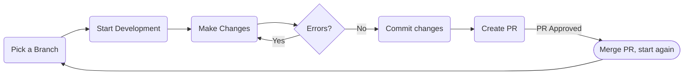

# The development lifecycle

## Overview

This page contains all the information about the development lifecycle of the documentation.

## Editing files

### Starting development

To start off you will run `docker-compose up` to start the docker container and live reload server.

### Modifying and saving markdown files

Modify any markdown files you want and save the changes. After saving, the localhost will reload and you can check your changes. For an in-depth tutorial on how to modify all files and the specific features/syntax included in this documentation check out [this](./editing-files.md) page.

## Uploading changes

### Commiting to your fork

After all edits have been made you can commit the changes to your repo. You should follow these main guidelines:

- There **is** such a thing as too many commits. As much as we want you to separate each change into it's own commit try to not do 100 commits.
- Also don't do just 1 commit, if you only fix 1 file than 1 commit is fine, but if you have edited multiple files then more than 1 commit is appreciated.
- Make proper commit messages; don't just say `fixed grammar`, specify the page and what section you have fixed.

### Creating a PR

After you finalise your edits and have commited them all to your fork you can create a PR back to the documentation repo. Once again the same rules apply as commit messages, try to make them specific. After submitting your PR it will be reviewed and if accepted by one of our admins it will be merged into the live docs.

## Done

Your changes will now be live here on the documentation! You can check them out by navigating to the page you modified.

### Lifecycle

This is a diagram of the development lifecycle:

## Further Reading

- **[Easy Editing]** – Simplest way to edit the documentation.
- **[Setup]** – Setup the local development environment.
- **[Development Lifecycle]** – Lifecycle of changes to the documentation.
- **[Editing Files]** – Overview of markdown features used for the docs, such as these cards.
- **[Adding Pages]** – Add new pages to the nav and sidebars.
- **[Special Files]** – For special pages and other files.

[Easy Editing]: ./easy-editing.md
[Setup]: ./setup.md
[Development Lifecycle]: ./development-lifecycle.md
[Editing Files]: ./editing-files.md
[Adding Pages]: ./adding-pages.md
[Special Files]: ./special-files.md
