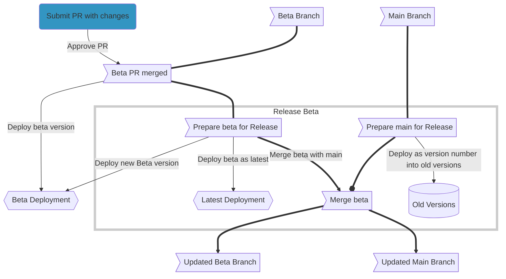
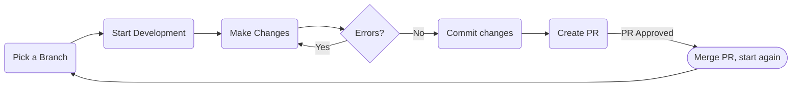

# The development lifecycle

## Overview

This page contains all the information about the development lifecycle of the documentation. Start here with this diagram:

#### This is a flowchart you can reference which has the timeline of events happening during development

The highlighted blue node is where your changes will be entered into the process. You will creata Pull Request to have your code reviewed and then merged into the specified branch.

## Picking a branch

At the start of each change you want to work on you will first workout which branch to use. 99% of the time you should use the `beta` branch so that your changes are included in future versions of the documentation.

## Editing files

### Starting development

To start off you will run `docker-compose up` to start the docker container and live reload server.

### Modifying and saving markdown files

After selecting a branch you will modify any markdown files you want and save the changes. After saving, the localhost will reload and you can check your changes. For an in-depth tutorial on how to modify all files and the specific features/syntax included in this documentation check out [this](./editing-files.md) page.

## Uploading changes

### Commiting to your fork

After all edits have been made you can commit the changes to your repo. You should follow these main guidelines:

- There is such thing as too many commits. As much as we want you to separate each change into it's own commit try to not do 100 commits.
- Also don't do just 1 commit, if you only fix 1 file than 1 commit is fine, but if you have edited multiple files than more than 1 commit is appreciated.
- Make proper commit messages; don't just say `fixed grammar`, specify the page and what section you have fixed.

### Creating a PR

After you finalise your edits and have commited them all to your fork you can create a PR back to the documentation repo. Once again the same rules apply as commit messages, try to make them specific. After submitting your PR it will be reviewed and accepted by one of our admins and then it will enter the workflow found [here](#this-is-a-flowchart-you-can-reference-which-has-the-timeline-of-events-happening-during-development).

## Done

Your changes will now be live here on the documentation! You can check them out by navigating to the page you modified.

### Lifecycle

This is a diagram of the development lifecycle:

### Further Reading

Now that you understand the basic workflow of editing the docs you can checkout these guides to get started on editing:

- [Editing Pages - Markdown](./editing-files.md)
- [Adding Pages](./adding-pages.md)
- [Special Pages - Other files](./special-files.md)
