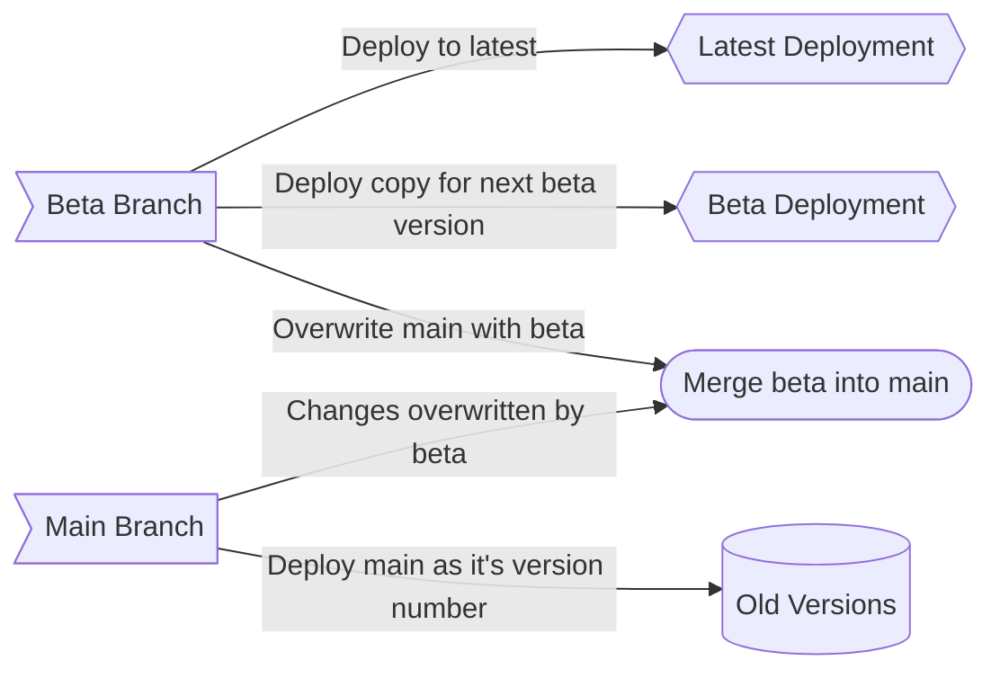

# Contributing to the HASS.Agent Documentation

!!! note "Easier Editor"

    If you do not understand the basics of VSCode or git version control then take a look at [this](./easy-editing.md) page.

!!! warning

    **Make sure you understand the HASS.Agent client version system before continuing. You can find info on it [here](../developer-resources/version-system.md/#clientdocumentation-versioning).**

## Overview

The HASS.Agent docs are built on MKDocs, which is a python based tool that allows you to write documentation in simple markdown. Most of the docs is written in markdown and is therefore easily editable. However submitting these edits and testing them requires a basic understanding of git and github version control.

### The documentation versions

At the top of the documentation you will find a selector to the write of the title. This is a version selector that allows you to view different versions of the documentation. You will notice there are two special versions and the rest follow the format of `*.*`:

| Version  | Description                                                                                                                     |
| -------- | ------------------------------------------------------------------------------------------------------------------------------- |
| `beta`   | The current beta build of the documentation, used for trying new features and writing docs for upcoming features of HASS.Agent. |
| `latest` | The current latest release of HASS.Agent, this is also the default version.                                                     |
| `*.*`    | Older versions of the docs, these are not editable. These are known as `old-versions` Example: `1.5`                            |

## Github Structure

The repo for the documentation is linked at the top right of the documentation at all times and is also available [here](https://github.com/hass-agent/hass-agent.github.io){: target="\_blank"}. Go ahead and open it in another tab to reference as you go through this section.

### Branches Overview

The repo contains three branches:

| Branch     | Description                                                                                                                                                                                    |
| ---------- | ---------------------------------------------------------------------------------------------------------------------------------------------------------------------------------------------- |
| `main`     | Contains the files used to maintain the `latest`[^1] version of the documentation.                                                                                                             |
| `beta`     | Contains the files developing the next release of the documentation, this is also the `beta`[^1] version of the documentation.                                                                 |
| `gh-pages` | Contains the built files of the documentation, this repo is not to be touched, everything is written in HTML, CSS and JS. All the files are auto-generated during builds of the documentation. |

#### Why two separate branches?

We use two separate branches in the github as it allows us to work on new versions of the documentation while fixing issues with the current documentation. This is great for us as we can test new features online and send them to people without accidently destroying the `latest`[^1] documentation. However this does create a few guidelines that need to be followed:

- If you want your changes to be applied in all future versions of the documentation you **MUST** make these changes in the `beta` branch.
- Any changes made to the `main` branch will be immediately applied to the `latest`[^1] version however they will **not** be included in future versions of the documentation.

If you would like to know why these restrictions exist checkout [this](#why-are-there-restrictions) section.

### Deploying the documentation

After merges occur to either the `beta` or `main` branch specific github workflows will run that wil automatically build and deploy the correct version of the documentation. Therefore you **do not** need to ever do any sort of building or deploying.

#### Releasing the `beta` version

When it comes time to release the `beta`[^1] version of the documentation as the `latest`[^1] version, one of the admins of the github will manually trigger a workflow that will deploy and build the `beta` branch as the `latest`[^1] version and also deploy a copy for the `beta`[^1] version. After the deployment a merge will be triggered to merge the `beta` branch with the `main` branch. We will do our best to bring over changes from the `main` branch to the `beta` but we cannot guarantee, this is the reason for [this](#why-are-there-restrictions) section.

### Why are there restrictions?

These restrictions exist because of the way the system is built. Here is a diagram showing an example of changes made to the homepage:

You will notice that now the homepage is different on each of these versions, specifically the homepage on the `main` branch has been added changes that are not included in the `beta` branch version. Now if we have a look at what happens when the beta version is released as latest:

When we release the `beta`[^1] version, we copy the `latest`[^1] version into the `old-versions` by changing it's name to it's version number. Then the `beta`[^1] version is deployed to `latest`[^1] and a copy is created for developing the next version. Finally the `beta` branch is merged with the `main` branch. This means that any changes added into the `main` branch will be overwritten by the `beta` branch.

Now that you understand how the system works you can see why changes added to the `main` branch are not included in future versions of the documentation.

[^1]: This corresponds to the label in the documentation version selector.
