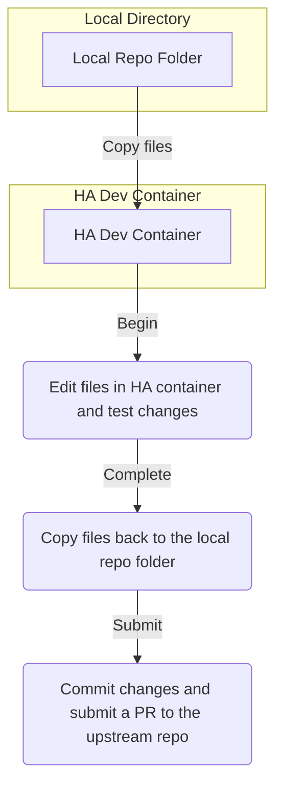

# Integration Development Lifecycle

**Here is a good diagram showing the development lifecycle**

## Events in order

#### Copy files

Make sure the local repo folder is in sync with upstream and then copy the `custom_components` folder from the local repo folder to the `.config` directory.

#### Begin

Start the dev container and start editing files.

#### Complete

Finish testing and editing, and then copy the `custom_components` files back to the local repo folder.

#### Submit

Upload/Commit changes and submit a PR to the github organization.
