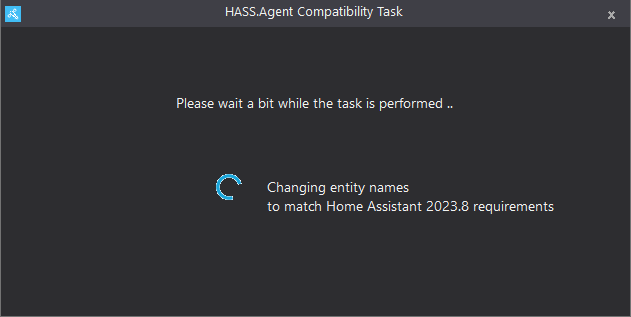

# Troubleshooting the Installation and setup of HASS.Agent

## Getting Help

There are lots of places you can get help, we have more info in the [Getting Help](../getting-help.md) section.

## Debugging Tips

### MQTT Explorer

MQTT Explorer is a great tool for debugging MQTT issues. To use it:

1. Download and install [MQTT Explorer](https://mqtt-explorer.com/){target="_blank"}.
2. Open MQTT Explorer.
3. Connect to your MQTT broker.

## Frequent Issues

### Device not showing in Home Assistant

Unfortunately autodiscovery issues are common, currently the best way to fix it is to reinstall the integration.

???+ warning

    Only notifications and the media player will show under the Hass.Agent integration. For Commands and Sensors you need to look under the MQTT integration.

**Solution**

1. Remove integration.
      1. Open HACS.
      2. Open `Hass.Agent 2 Integration - Media Player & Notifications`.
      3. Click 3 dots.
      4. Click `Remove`.
2. Restart Home Assistant.
3. Install integration as normal.
4. Restart Home Assistant.

This should solve most issues with devices not appearing.

### Old devices showing in Home Assistant after being removed

If you have old devices showing in Home Assistant after being removed, you can try restarting Home Assistant. If they still show try the following steps:

1. Open [MQTT Explorer](#mqtt-explorer).
2. Find the topic `homeassistant/device_type/your_device_name/old_entity` and delete it.

???+ tip "What if I delete an active entity?"

    If any **HASS.Agent** entity is removed it will automatically be added, so you don't need to worry about losing any data. Be careful not to remove anything not HASS.Agent related.

### Entity Naming Warning

If you are seeing entity name warnings in the Home Assistant console it is most likely due to a change made a while ago to the way entities are named.

??? info "What changed? Technical overview"

    **HA automatically appends device names now**
    The change HA implemented is that it now automatically appends device names to the start of entity names. So if your device is named `my-pc` and the entity is called gpu-temp HA will automatically join these to create `my-pc_gpu-temp`.

    **Why do I need to do anything?**
    If you don't do anything, and you have currently named your entities with the device at the start(was default in V1) it will show as a console error because the entity will be named: `my-pc` + `my-pc_gpu-temp` creating: `my-pc_my-pc_gpu-temp`.

**Solution**

HASS.Agent V2 comes bundled with a `compat_names` arguement that can be passed to the .exe to automatically fix the names. You can use it by following these steps:

1. Type in powershell into windows search and run it as admin.
2. Use this command to switch to HASS.Agent directory: `cd C:\Users\YOURUSERNAME\AppData\Local\Hass.Agent\Client`.
3. You should now be in an admin powershell window inside of the hass.agent directory, type in the following command: `.\HASS.Agent.exe compat_names`.
4. You should see a popup like the one below and no errors in the console, after it completes it will close and you can close all the windows before re-opening HASS.Agent.

### MQTT Connection Loop

If MQTT is changing from `running` to `connecting` you possibly have 2 installations with the same Client ID.

Client ID is found under `Configuration > MQTT`, each installation needs a different one, even if on the same machine.

**If you have 2 windows users they need different Client IDs.**

### Old Version Causing Issues

If you have an older version of HASS.Agent enabled it can cause issues for the latest one.

1. Remove or Disable any versions of HASS.Agent not currently being used.
2. Open [MQTT Explorer](#mqtt-explorer).
3. Delete any topics with `Lab02` as these are pre-2.0 HASS.Agent.
